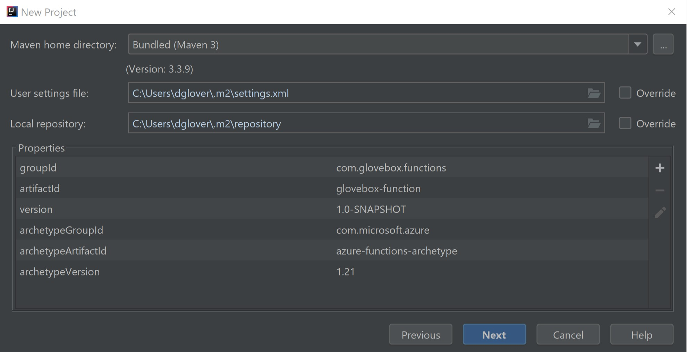

# Creating your first Kotlin Azure Function

|Author|[Dave Glover](https://developer.microsoft.com/en-us/advocates/dave-glover), Microsoft Cloud Developer Advocate |
|----|---|
|Solution| [Creating your first Kotlin Azure Function](https://github.com/gloveboxes/Create-your-first-Azure-function-with-Kotlin-and-IntelliJ)|
|Documentation|[README](https://gloveboxes.github.io/Creating-an-image-recognition-solution-with-Azure-IoT-Edge-and-Azure-Cognitive-Services/) |
|Platform| [Azure Functions](https://docs.microsoft.com/en-us/azure/azure-functions?WT.mc_id=devto-blog-dglover)|
|Programming Language| Kotlin|
|Date|As at April 2019|

**Documentation** 
- [Create your first Azure function with Java and IntelliJ](https://docs.microsoft.com/en-us/azure/azure-functions/functions-create-maven-intellij?WT.mc_id=devto-blog-dglover)
- [Azure Functions Java developer guide](https://docs.microsoft.com/en-us/azure/azure-functions/functions-reference-java?WT.mc_id=devto-blog-dglover)
- [Library for Azure Java Functions](https://github.com/Azure/azure-functions-java-library)
- [Register Azure Functions binding extensions](https://docs.microsoft.com/bs-latn-ba/azure/azure-functions/functions-bindings-register?WT.mc_id=devto-blog-dglover)

## Set up your development environment

To develop a function with Java and IntelliJ, install the following software:

- [Java Developer Kit](https://www.azul.com/downloads/zulu/) (JDK), version 8
- [Apache Maven](https://maven.apache.org), version 3.0 or higher
- [IntelliJ IDEA](https://www.jetbrains.com/idea/download), Community or Ultimate versions with Maven
- [Azure CLI](https://docs.microsoft.com/cli/azure?WT.mc_id=devto-blog-dglover)

> The JAVA_HOME environment variable must be set to the install location of the JDK to complete the steps in this article.

 We recommend that you install [Azure Functions Core Tools, version 2](functions-run-local.md#v2). It provides a local development environment for writing, running, and debugging Azure Functions.

## Create a Functions project

1. In IntelliJ IDEA, select **Create New Project**.  
1. In the **New Project** window, select **Maven** from the left pane.
1. Select the **Create from archetype** check box, and then select **Add Archetype** for the [azure-functions-archetype](https://mvnrepository.com/artifact/com.microsoft.azure/azure-functions-archetype).
1. In the **Add Archetype** window, complete the fields as follows:
    - _GroupId_: com.microsoft.azure
    - _ArtifactId_: azure-functions-archetype
    - _Version_: Use the latest version from [the central repository](https://mvnrepository.com/artifact/com.microsoft.azure/azure-functions-archetype) 
1. Select **OK**, and then select **Next**.
1. Enter your details for current project, and select **Finish**.

Maven creates the project files in a new folder with the same name as the _ArtifactId_ value. The project's generated code is a simple [HTTP-triggered](/azure/azure-functions/functions-bindings-http-webhook) function that echoes the body of the triggering HTTP request.


## Specify the Maven basic Elements

Define the GroupId and the ArtifactId for the project This information is added to the project pom.xml.

The ArtifactId forms part of the Azure Function name in the pom.xml file.

For more information see [Creating a new Maven project](https://www.jetbrains.com/help/idea/2018.3/maven-support.html?utm_content=2018.3&utm_medium=link&utm_source=product&utm_campaign=IC#create_new_maven_project)


## Confirm the Maven Project settings



## Confirm Project Name and Location


The project structure will be created.

## Enable Auto-Import


## Azure Configuration

By default the pom.xml file is opened when the project is created.

You can set the following project properties in the pom.xml file

1. Azure Function App Name
2. Azure Function App Region

Run the following command for a complete list of regions. Choose the location by the "name" field in the returned json array. 

```bash
az account list-locations
```


## Open the default Http Trigger

The Azure Functions Maven Archetype will create an example Http Trigger. You will find this by navigating the **src** project directory.


## Convert the Java Azure Function to Kotlin file

Right mouse click the default Java Function named **Function** and select **Convert Java File to Kotlin File**. And voila, the Java file is magically convert a Kotlin project.


The default Azure Function converted from Java will now look like beautiful Kotlin.


## Configure the Project for Kotlin

From the **Tools** menu, select **Kotlin**, then **Configure Kotlin in Project**


## Enable All Modules containing Kotlin files


## Clean and Package the Project

From the Maven pop-out tab, expand **Lifecycle**, then run the **clean** followed by the **package** commands. This will build the Kotlin project.


## Execute Azure Functions Run

From the Maven pop-out tab, expand **Plugins**, then run the **azure-functions:run**. This will start the Azure Functions Core Tools and bootstrap your Kotlin Azure Function.

To test the function click the http://localhost:7071/api/HttpTrigger-Java link


## Pass in a parameter on the Query String

In the browser add a name parameter to the query string. For example http://localhost:7071/api/HttpTrigger-Java?name=dave and you will see the webpage echos the value passed in for name.


## Stop the function

Click the stop icon to stop the function from running.


## Enable Debugging

Right mouse click on the **azure-functions:run** Maven Archetype and select **Create 'glovebox-function [...**


### Create Run/Debug Configuration

Add **-DenableDebug** to the command line.


### Enable Java Debugger Attach

From **Run** menu, select **Edit Configuration**


#### Add New Configuration

Click the **+** sign, then select **Remote**.


#### Name the New Configuration

In this case the configuration is named **Attach Debugger**


#### Set a breakpoint in the Kotlin Azure Function source


#### Run Debugger Enabled Configuration

From the **run/debug configuration selector** select the Maven azure-functions:run configuration. and the click the green start icon or press Shift+F10.


#### Attach the Debugger

From the **run/debug configuration selector** select the **Attach Debugger** configuration and click the green start debugger icon or press Shift+F9.


